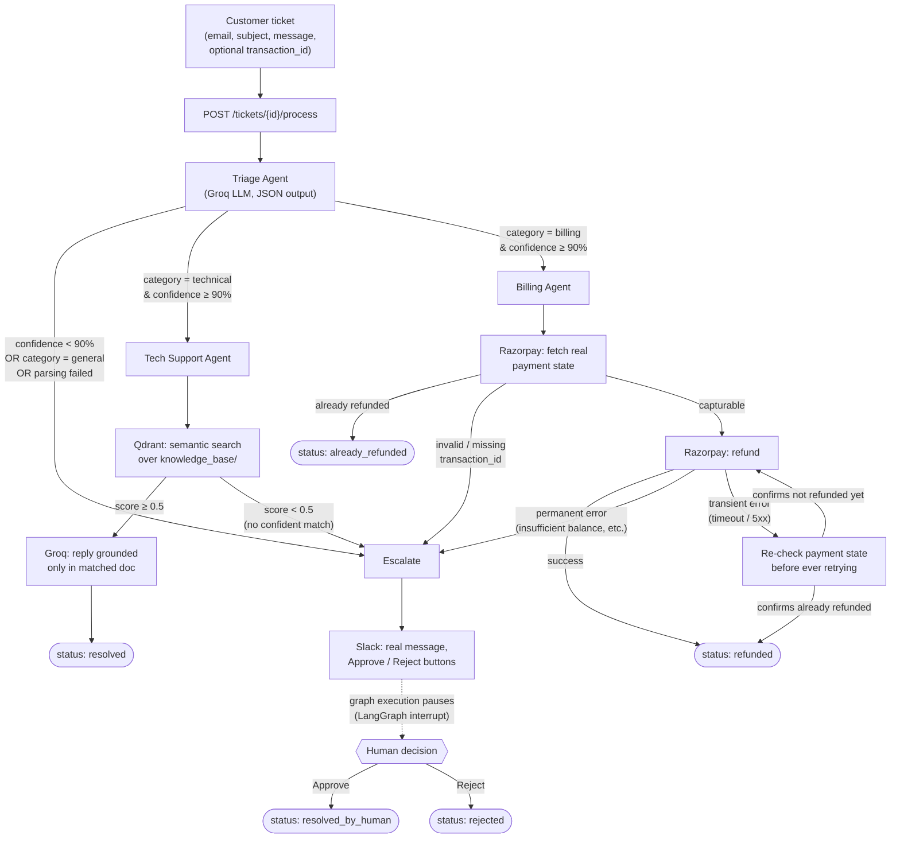

# Multi-Agent Resolution Engine

An autonomous support-ticket system: a ticket comes in, gets classified, and is either resolved automatically by a specialist agent (technical support via RAG, billing via a real payment API) or escalated to a human via Slack — with real idempotency, retry, and observability behind it, not just an LLM call wrapped in a try/except.

Built incrementally as a learning project, with every external integration verified against the real API, not mocks alone.

## Architecture



Every node above is traced in LangSmith — which agent ran, how long each step took, and token usage for every LLM call.

## Why this shape

**Three agents, one router, one graph.** The Triage Agent never answers a ticket — its only job is classification and confidence. That confidence gate is the actual guardrail: a category prediction alone isn't enough to trust an agent with a customer's money or a plausible-sounding-but-wrong technical answer.

**Deterministic transaction IDs, never LLM-guessed.** The Billing Agent requires an explicit `transaction_id` field. Having the LLM extract one from free text was considered and rejected — a hallucinated payment ID before a refund is exactly the kind of blind trust this system is built to avoid.

**Two-layer refund idempotency.** Before ever calling Razorpay: (1) if the ticket's own record already shows `refunded`/`already_refunded`, skip the API entirely; (2) otherwise, check the payment's real status on Razorpay's side, in case that state ever disagrees with ours. Neither layer trusts a naive "have I seen this ticket before" check alone.

**Refund timeouts are never blindly retried.** A timeout doesn't tell you whether the request succeeded before the connection dropped. On a transient failure, the agent re-fetches the payment's real state first — if it now shows `refunded`, the original call actually succeeded; only if it's confirmed still unrefunded does the agent retry, and only once.

**`general` always escalates, even at 99% confidence.** There's no agent built to handle it — answering anyway would mean fabricating a response with no grounding. Confidence about *what a ticket is* doesn't mean confidence about *how to handle it*.

**Approve/Reject don't re-run any agent.** Approve marks the ticket `resolved_by_human` (someone handled it outside the system — e.g. processed a refund manually). It deliberately does not retry the original action automatically, since that would undo the timeout-safety logic above.

## Tech stack, and why

| Component | Choice | Why |
|---|---|---|
| API | FastAPI | Async, typed, auto-generated docs |
| Orchestration | LangGraph | Needed real pause/resume for Slack human-in-the-loop (`interrupt()` + checkpointer) — a plain `if/elif` router would've sufficed for routing alone, but not for that |
| LLM | Groq (`openai/gpt-oss-120b`) | Originally Anthropic; switched to a free tier for cost-free iteration during development |
| Vector DB | Qdrant (local, Docker) | Free, self-hosted, sufficient for a 6-document knowledge base |
| Embeddings | `sentence-transformers` (local) | No verified free embeddings API existed on the chosen LLM provider; runs on CPU, no per-request cost |
| Payments | Razorpay (test mode) | **Originally Stripe** — blocked because Stripe has been invite-only for new India-based accounts since mid-2024 (RBI-related restriction); Razorpay is India's equivalent and arguably more relevant for this market |
| Human-in-the-loop | Slack (`slack_sdk`, not `slack_bolt`) | Bolt wants to own its own web server/routing, which would've conflicted with the existing FastAPI app instead of plugging into it |
| Observability | LangSmith | Free tier; already a `langgraph` dependency, so node-level tracing is close to zero-cost to add |

## Real problems hit and fixed, not hidden

This project's actual engineering value is here more than in the happy path.

- **Stripe blocked new India accounts entirely.** Confirmed via Stripe's own support docs, not assumed. Pivoted to Razorpay rather than misrepresent account location to route around a regulator-driven restriction.
- **Razorpay refunds failed with a generic `BAD_REQUEST_ERROR`.** Root-caused to the account's test-mode balance being short by exactly the processing fee on a single-payment test — every transaction fee reduces what actually lands in the merchant's balance, so refunding the *full* amount a customer paid requires more net balance than that one transaction provided. Confirmed by capturing two more test payments and retrying successfully.
- **A signing-secret mismatch silently rejected every real Slack webhook** with a generic `401`. Diagnosed by comparing our computed HMAC signature against Slack's actual received signature side-by-side (not guessing) — traced to copying "Client Secret" instead of "Signing Secret" from Slack's Basic Information page, which shows both.
- **Slack's Approve/Reject buttons stayed visible after being clicked.** Slack doesn't auto-update a message just because the webhook responded — it requires an explicit `replace_original: true` in the response.
- **A corrupted PyTorch install** from an interrupted background upgrade, caused by running the project inside a OneDrive-synced folder (OneDrive was actively syncing hundreds of thousands of `.venv` files mid-install). Fixed by moving the whole project outside any cloud-synced directory — the actual root cause, not a one-off patch.
- **RAG retrieval under-performs when a customer's wording doesn't match the document's own terminology.** Found via the evaluation dataset: a rate-limit complaint phrased colloquially ("we're getting rate limited constantly") scored 0.439 against the correct document — just under the 0.5 match threshold — while an otherwise-identical complaint that literally said "status code 429" passed easily. Not a threshold-tuning fix so much as a real limitation of semantic search against short, single-topic documents worth knowing about.

## Evaluation

`evaluation/dataset.json` — 60 hand-written tickets, each with an expected category and expected final status (not just category, since a ticket can be correctly classified and still fail to resolve correctly). `evaluation/run_evaluation.py` runs the real pipeline (real Groq, Qdrant, Razorpay — no mocks) against it.

**Latest run: 59/60 (98%) status accuracy, 48/49 (98%) category accuracy on the 49 checkable cases (11 are deliberately ambiguous, checked only for correct escalation), 2.84s average latency per ticket.**

Both discrepancies are root-caused, not glossed over — see `evaluation/results.json` and the commit history for the full analysis. Billing test cases only use deterministic, already-known-state Razorpay data (an already-refunded payment, invalid/missing IDs) — a genuinely fresh successful refund is intentionally excluded from the repeatable suite, since it would consume a real payment on first run and can't be re-tested identically on the next.

## Known limitations

- **In-memory ticket store and LangGraph checkpointer.** Both are Python process memory, not a database. A ticket paused waiting on a Slack decision is lost if the server restarts before someone responds — confirmed in practice during testing. A real deployment needs persistent storage (Postgres) for both.
- **LangSmith cost tracking shows $0.** Token counts are captured correctly; LangSmith has no pricing entry for Groq's open-source models, so it can't compute a dollar figure from them.
- **Groq's model quality is a real tradeoff**, not free — it's meaningfully less capable than a frontier model for nuanced judgment calls, though sufficient for the classification and RAG-grounded generation this system asks of it.
- **Slack integration requires a public tunnel (ngrok) for local development**, since Slack needs a reachable HTTPS URL for interactivity webhooks. Each `ngrok` restart issues a new URL that has to be re-entered into Slack's app settings.

## Project structure

```
app/
├── agents/          # triage.py, tech_support.py, billing.py — one resolve_*() function each
├── api/             # FastAPI routers: tickets.py, slack.py, health.py
├── models/          # Ticket / TicketCreate pydantic schemas
├── rag/             # embeddings.py, vector_store.py, search.py
├── graph.py         # LangGraph pipeline: nodes, routing, interrupt/resume
├── llm.py           # Groq wrapper (the only file that knows about Groq)
├── payments.py      # Razorpay wrapper (the only file that knows about Razorpay)
├── slack_client.py  # Slack message sending (the only file that knows about Slack)
├── retry.py         # generic transient-vs-permanent retry helper
└── store.py         # in-memory ticket store

knowledge_base/      # 6 markdown docs for the Tech Support Agent's RAG search
evaluation/          # ground-truth dataset + evaluation runner
scripts/             # one-off dev scripts (index building, manual API checks)
tests/               # pytest suite, fully mocked — no real API calls, no network
```

## Running it locally

Requirements: Python 3.14+, Docker (for Qdrant), and accounts for Groq, Razorpay (test mode), Slack, and LangSmith (all free tiers).

```bash
python -m venv .venv
./.venv/Scripts/pip install -r requirements.txt

# Start Qdrant
docker run -d --name ai-ops-qdrant -p 6333:6333 -p 6334:6334 -v ai-ops-qdrant-storage:/qdrant/storage qdrant/qdrant

# Copy .env.example to .env and fill in real keys, then:
python -m scripts.build_index      # index the knowledge_base/ docs into Qdrant
python -m uvicorn app.main:app --reload
```

Run the test suite (fully mocked, no external calls, no cost):

```bash
python -m pytest
```

Run the real evaluation (hits real Groq/Qdrant/Razorpay, no cost beyond token usage):

```bash
python -m evaluation.run_evaluation
```

## What's implemented (original spec's 16 milestones)

1. ✅ Environment, project structure, FastAPI scaffold
2. ✅ Ticket ingestion API
3. ✅ LLM integration
4-5. ✅ Technical docs dataset + Qdrant RAG pipeline
6. ✅ Triage Agent
7. ✅ Tech Support Agent
8. ✅ Payment API integration (Razorpay, pivoted from Stripe)
9. ✅ Billing Agent
10. ✅ LangGraph orchestration
11. ✅ Retry and error handling
12. ✅ Slack human-in-the-loop
13. ✅ LangSmith observability
14. ✅ Evaluation with a ground-truth dataset
15. ⬜ Frontend/dashboard — optional per original spec, not built
16. ✅ Documentation + architecture diagram (this file)
